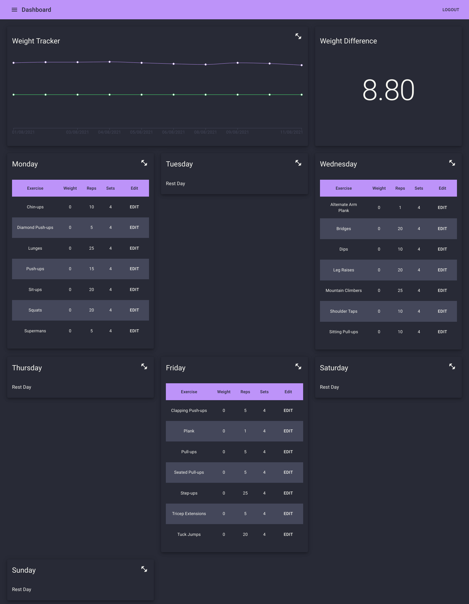

# Lyfe

Lyfe is a simple weight and exercise tracker written in .NET Core, React, and Typescript using Okta for authentication.

## Getting Started

### Create a Database

1. Run `dotnet tool install --global dotnet-ef`
2. Run `cd ./src/Lyfe`
3. Run `dotnet ef database update`

### Build and Run

1. Run `cd ./src/Lyfe/ClientApp`
2. Run `npm install`
3. Run `cd ..`
4. Copy `appsettings.json` to `appsettings.Development.json` and fill in all of the empty values.
5. Run `dotnet build`
6. Run `export ASPNETCORE_ENVIRONMENT=Development`
7. Run `dotnet run`
8. Browse to [https://localhost:5001](https://localhost:5001)

### Test

1. Run `cd ./tests/Lyfe.Tests`
2. Run `dotnet test`

### Migrations

1. Run `cd ./src/Lyfe`
2. Run `dotnet ef migrations add <migration_name>`
3. Run `dotnet ef database update`
